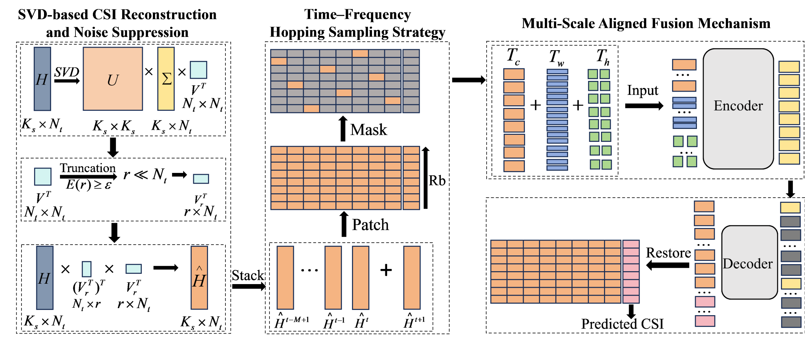
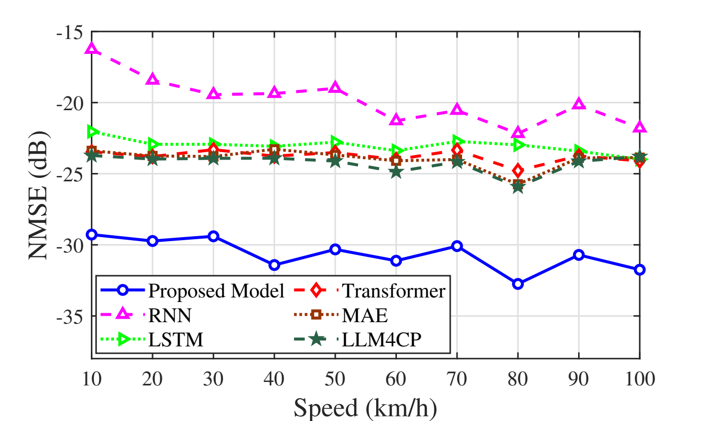
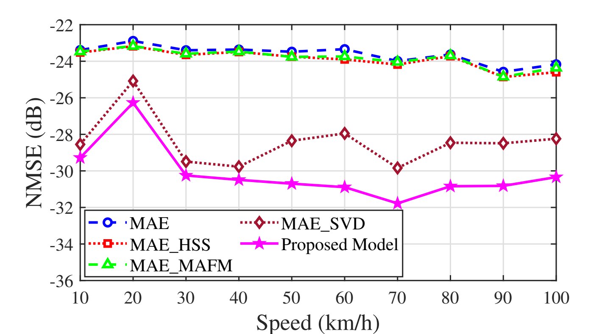
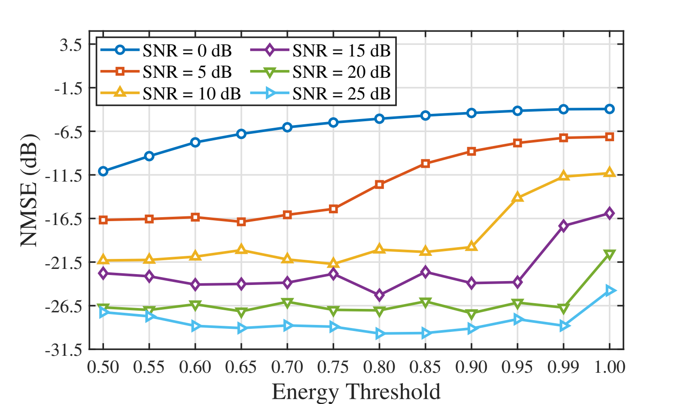
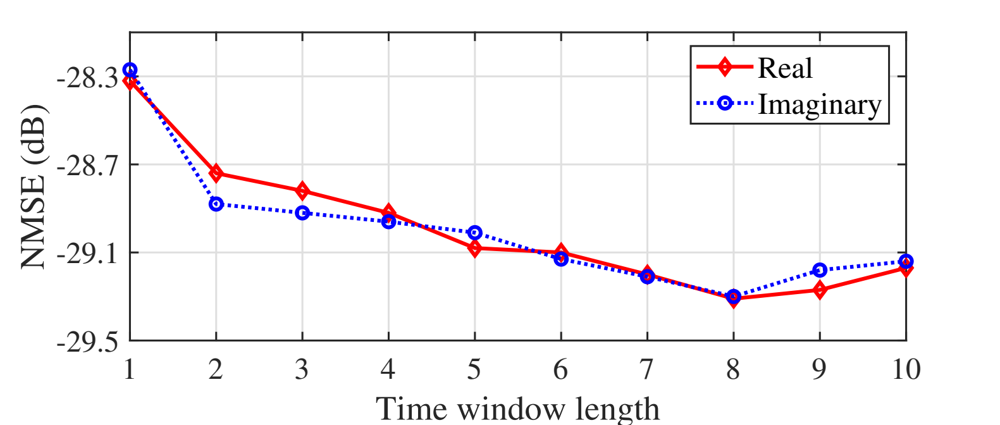

<div align="center">

# Enhanced MAE for CSI Prediction

**An Enhanced Masked Autoencoder Framework for CSI Prediction in Wireless Systems**

Yifan Zhou · Qing Zhang · Yixiao Gu · Zhichao Sheng · Dan Zeng


</div>

<p align="center">
  
</p>

## Overview

Enhanced MAE predicts future channel state information (CSI) from historical CSI. It improves a standard masked autoencoder at three complementary stages:

- **SVD-based reconstruction** suppresses noise while retaining the dominant channel subspace.
- **Time-frequency hopping sampling** gives visible patches more uniform coverage than independent random masking.
- **Multi-scale aligned fusion** combines CSI features at multiple time-frequency resolutions.

On the 25 dB test setting reported in the paper, the model reaches **-29.31 dB NMSE**, **0.9988 R²**, and **3.05% EVM** with **3.26 M parameters** and **152.38 M FLOPs**.

## Results

| Model | NMSE (dB) ↓ | R² ↑ | EVM (%) ↓ | Train / total params (M) | FLOPs (M) |
|---|---:|---:|---:|---:|---:|
| RNN | -19.25 | 0.9880 | 9.21 | 2.37 / 2.37 | 576.62 |
| LSTM | -23.34 | 0.9953 | 6.21 | 2.43 / 2.43 | 610.48 |
| Transformer | -24.19 | 0.9961 | 6.07 | 3.36 / 3.36 | 515.48 |
| MAE | -24.22 | 0.9962 | 5.81 | 3.20 / 3.20 | 124.98 |
| LLM4CP | -24.50 | 0.9964 | 5.62 | 4.03 / 99.31 | 637.71 |
| **Enhanced MAE** | **-29.31** | **0.9988** | **3.05** | **3.26 / 3.26** | **152.38** |

The table reproduces the paper's 25 dB comparison. FLOPs include the SVD preprocessing overhead for Enhanced MAE.


### Paper results at a glance

<table>
  <tr>
    <td width="50%" align="center">
      <br/>
      <b>Robustness to channel noise.</b> Enhanced MAE consistently obtains the lowest NMSE across the evaluated SNR range.
    </td>
    <td width="50%" align="center">
      <br/>
      <b>Robustness to mobility.</b> The proposed model maintains its advantage from 10 to 100 km/h.
    </td>
  </tr>
  <tr>
    <td width="50%" align="center">
      <br/>
      <b>Component ablation.</b> SVD reconstruction, hopping sampling, and multi-scale fusion provide complementary gains.
    </td>
    <td width="50%" align="center">
      <br/>
      <b>SVD threshold.</b> The preferred energy threshold changes with SNR, while performance remains stable around the selected value.
    </td>
  </tr>
</table>

<p align="center">
  <br/>
  <b>Historical window length.</b> Longer CSI histories generally improve prediction by providing richer temporal correlation.
</p>

These plots are reproduced directly from the manuscript. See the paperfor the complete experimental settings and analysis.

## Quick start

### 1. Create the environment

The paper experiments use PyTorch on one NVIDIA RTX 3090. The supplied environment targets Python 3.10, PyTorch 2.2, and CUDA 11.8.

```bash
conda env create -f environment.yml
conda activate enhanced-mae
pip install -e .
```

Check that the model can complete a CPU forward pass:

```bash
enhanced-mae smoke-test
```

### 2. Prepare the data

Place one processed dataset in a directory containing four NumPy files:

```text
data/25dB_svd090_norm_8to1_dataset/
├── train_inputs.npy
├── train_labels.npy
├── test_inputs.npy
└── test_labels.npy
```

For the default 8-to-1 task, inputs resolve to `(N, 2, 64, 256)` and labels to `(N, 2, 64, 32)`. Complex arrays with shape `(N, 64, W)` and channel-last real arrays with shape `(N, 64, W, 2)` are also accepted.

Validate the files before launching a long run:

```bash
enhanced-mae check-data --data data/25dB_svd090_norm_8to1_dataset
```

See [Data preparation](docs/DATA.md) for the channel settings, normalization contract, and release status.

### 3. Train

```bash
enhanced-mae train \
  --model enhanced-mae \
  --data data/25dB_svd090_norm_8to1_dataset \
  --output outputs/enhanced-mae-25db \
  --device cuda \
  --epochs 300
```

The installable package removes machine-specific paths while keeping the original research implementations traceable. It also supports `mae`, `rnn`, `lstm`, `transformer`, `llm4cp`, `ablation-hop`, and `ablation-multiscale`; run `enhanced-mae train --help` for details.

### 4. Evaluate a checkpoint

```bash
enhanced-mae evaluate \
  --data data/25dB_svd090_norm_8to1_dataset \
  --checkpoint outputs/enhanced-mae-25db/<run-name>/best.pt \
  --output outputs/evaluation \
  --device cuda
```

This reports NMSE, R², EVM, parameter count, FLOPs, and the theoretical RTX 3090 inference time. A step-by-step paper reproduction map is available in [docs/REPRODUCIBILITY.md](docs/REPRODUCIBILITY.md).

## Repository layout

The stable package lives in src/enhanced_mae/; see the [experiment guide](experiments/README.md) for the public API and the relationship to the original experiment scripts.

```text
.
├── src/
│   └── enhanced_mae/          # Installable package and unified CLI
├── experiments/
│   ├── training/              # Main model, baselines, and ablations
│   └── evaluation/            # Paper metrics and robustness studies
├── scripts/                   # Backward-compatible command wrappers
├── tests/                     # Data-contract and repository tests
├── docs/                      # Data and reproduction documentation
├── paper/                     # Manuscript, references, and figures
├── assets/                    # README media
├── pyproject.toml
├── environment.yml
└── CITATION.cff
```

## Reproducibility status

The code, paper, portable command-line wrappers, dataset validator, and model smoke test are included. The processed QuaDRiGa data and trained checkpoints are not present in this local release package, so exact paper-number reproduction additionally requires those artifacts. Their expected format and a public-release checklist are documented in [docs/DATA.md](docs/DATA.md) and [docs/RELEASE_CHECKLIST.md](docs/RELEASE_CHECKLIST.md).


## Acknowledgements

The channel data are generated with [QuaDRiGa](https://quadriga-channel-model.de/) following the 3GPP UMa NLOS setting. The comparisons include RNN, LSTM, Transformer, MAE, and LLM4CP baselines. We thank the authors and maintainers of these projects and PyTorch.

## Dataset

Check the link for the dataset used in the experiment：https://pan.baidu.com/s/13M_mxP_m_eg4J3hfkSURyA 2580
